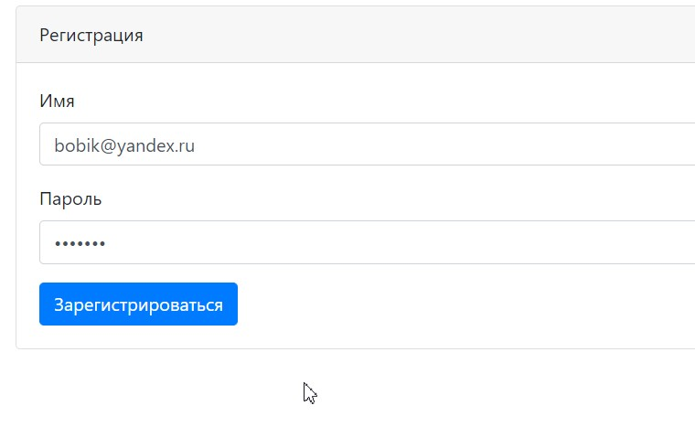
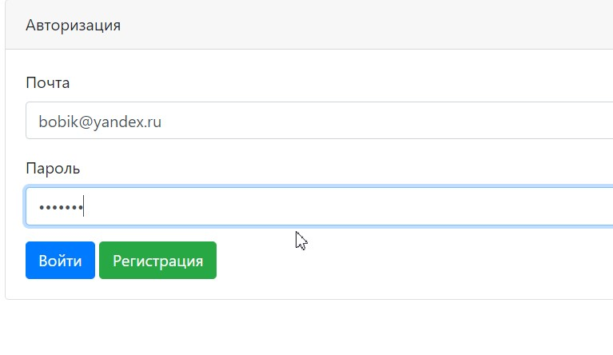
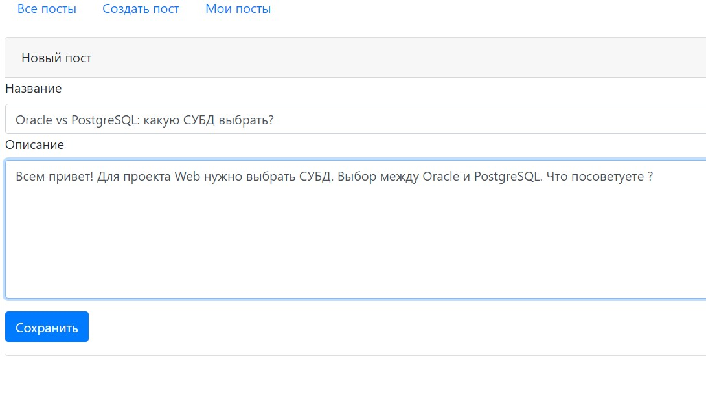
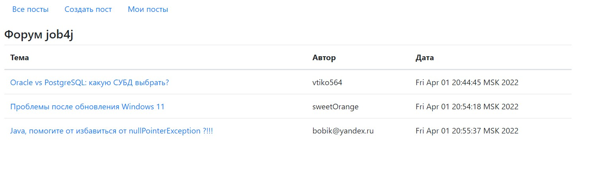
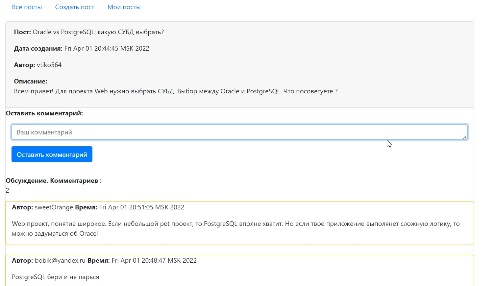
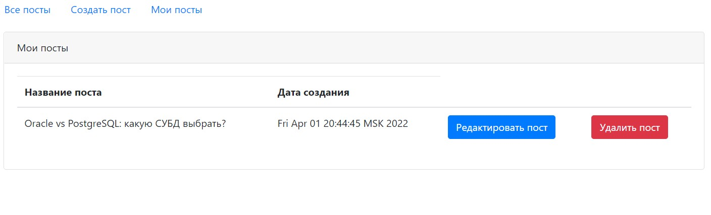

# Job4j. Проект "Forum".

Учебный мини проект "Форум". 
Доступные возможности:
- Регистрация/Авторизация
- Создание, редактирование постов
- Оставлять комменатрии к постам 

Целью проекта является изучение возможностей Spring Boot.

При создании использовались следующие технологии:
- Servlets
- JSP
- Postgres
- Liquibase
- Hibernate
- Spring 
- Spring Boot

